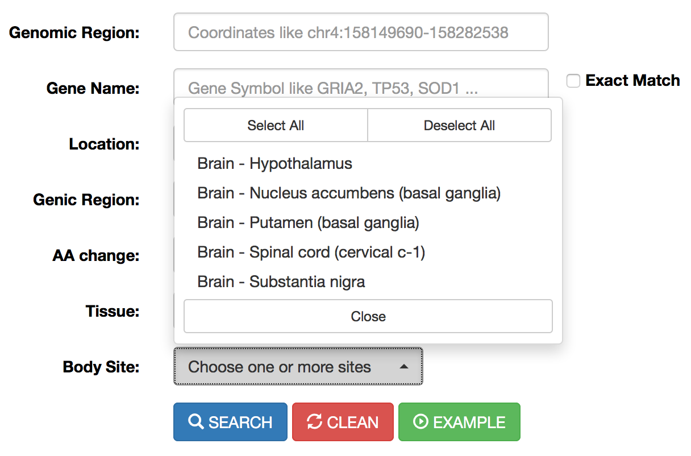
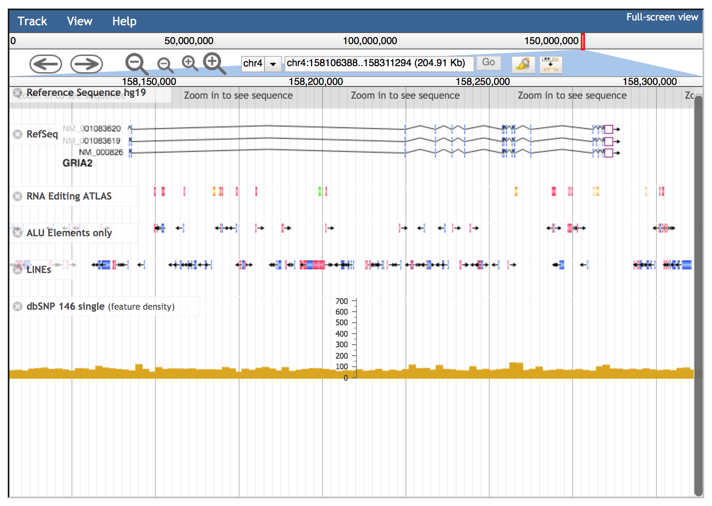
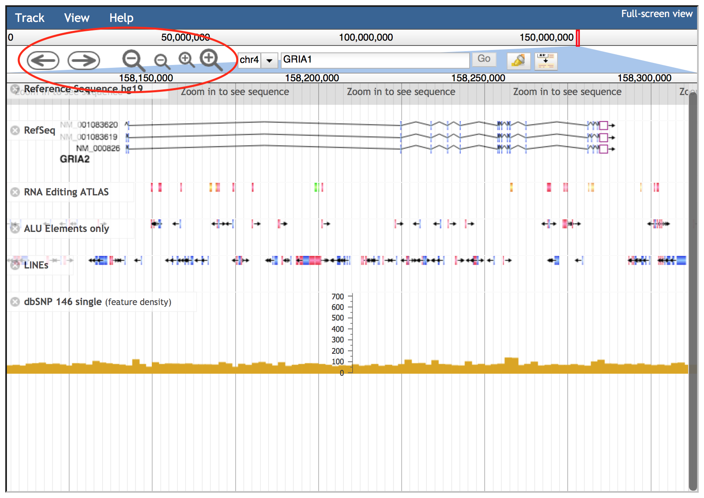

Searching into REDIportal is quite straightforward and also users with no bioinformatics skills can perform accurate searches across the database. RNA editing sites are stored according to their genomic positions and can be retrieved providing a genomic locus (“Genomic Region” field) or a known gene symbol (“Gene Name” field). Both fields are mutually exclusive.
Genomic loci can be interrogated entering chromosome coordinates in the format Chr:start-end (for example chr4:158101247-158308846).

 

  

RNA editing events in known genes can be retrieved entering the gene symbol in the “Gene Name” field. To avoid editing sites in intergenic regions surrounding the entered gene name, the “Extact Match” check box must be selected. The “Gene Name” field allows the autocomplete function to facilitate the selection of right gene.

 

  

Once the genomic region or gene name has been entered, the search can be refined using additional select menus. The following options are admitted:

<table class="table table-bordered">
<tr>
<th>Menu</th>
<th>Name</th>
<th>Option</th>
</tr>
<tr>
<td width="30%"></td>
<td style='text-align:center' width="20%"><b>Location</b></td>
<td>
<ul>
<li>ALU
<li>NONREP
<li>REP
</ul>

Location menu allows the selection of RNA editing sites residing in Alu elements (ALU) or repetitive elements non-Alu (REP) or non repetitive regions (NONREP).

</td>
</tr>
<tr>
<td width="30%"></td>
<td style='text-align:center' width="20%"><b>Genic Region</b></td>
<td>
<ul>
<li>5'UTR
<li>3'UTR
<li>Intronic
<li>Intergenic
<li>Exonic
</ul>

This menu allows the selection of RNA editing sites residing in specific genic regions such as: untranslated regions (UTR) or intronic regions or coding/non-coding exons or intergenic regions.
Reported classification has been carried out by <a href="http://annovar.openbioinformatics.org/en/latest/" target="blank">ANNOVAR</a>.

</td>
</tr>
<tr>
<td width="30%"></td>
<td style='text-align:center' width="20%"><b>AA Change</b></td>
<td>
<ul>
<li>Synonymous
<li>Nonsynonymous
<li>Stop Loss
<li>Unknown
</ul>

This menu allows the selection of RNA editing sites residing in protein coding regions and affecting codon integrity.
Reported classification has been carried out by <a href="http://annovar.openbioinformatics.org/en/latest/" target="blank">ANNOVAR</a>. 

</td>
</tr>
<tr>
<td width="30%"></td>
<td style='text-align:center' width="20%"><b>Tissue</b></td>
<td>
<ul>
<li>Adipose Tissue
<li>Adrenal Gland
<li>Blood
<li>...
<li>Thyroid
</ul>

This menu allows the selection of RNA editing sites residing in specific human tissues. More than one tissue can be selected per each search.
Tissue names are according to <a href="http://www.gtexportal.org/home/tissueSummaryPage" target="blank">GTEx</a>. 

</td>
</tr>
<tr>
<td width="30%"></td>
<td style='text-align:center' width="20%"><b>Body Site</b></td>
<td>
<ul>
<li>Brain - Hypothalamus
<li>Brain - Substantia nigra
<li>...
<li>Whole Blood 
</ul>

This menu allows the selection of RNA editing sites residing in specific human body sites. More than one body site can be selected per each search.
Body site names are according to <a href="http://www.gtexportal.org/home/tissueSummaryPage" target="blank">GTEx</a>. 

</td>
</tr>
</table>

A search example can be performed clicking on "Example" button.
All searches, instead, are activated by clicking the "Search" button. The search form can also be reset by clicking the "Clean" button.

Once a search has been performed, results will be displayed in a table including the following columns:

 

  

<table class="table table-bordered">
<tr>
<th width="20%">Column Name</th>
<th>Meaning</th>
</tr>
<tr>
<td><b>Chr</b></td>
<td>
Chromosome Name
</td>
</tr>
<tr>
<td><b>Position</b></td>
<td>
Chromosome Coordinate
</td>
</tr>
<tr>
<td><b>Ref</b></td>
<td>
Reference Nucleodite
</td>
</tr>
<tr>
<td><b>Ed</b></td>
<td>
Edited Nucleotide
</td>
</tr>
<tr>
<td><b>Strand</b></td>
<td>
Strand (+ or -)
</td>
</tr>
<tr>
<td><b>dbSNP</b></td>
<td>
a colored flag indicating the presence of a SNP in dbSNP. Only SNPs classified as "genomic" are taken into account. A green flag indicates a match with dnSNP and provides also an external link to NCBI

</td>
<tr>
<td><b>Location</b></td>
<td>
Location of RNA Editing in repetitive or non-repetitive regions.
</td>
</tr>
<tr>
<td><b>Repeats</b></td>
<td>
Class and family of repeat including the RNA editing position.
</td>
</tr>
<tr>
<td><b>Gene</b></td>
<td>
Gene Symbol
</td>
</tr>
<tr>
<td><b>Region</b></td>
<td>
Genic Region according to ANNOVAR
</td>
</tr>
<tr>
<td><b>EditedIn</b></td>
<td>
The number of Samples in which the specific position appears to be edited. It is showed by a progression bar.

</td>
</tr>
<tr>
<td><b>ExFun</b></td>
<td>
Exonic function limited to synonymous and non-synonymous positions. A colored flag is used to indicate if a site is synonymous (green) or non-synonymous (red). Click on to open a pop-up with details.

</td>
</tr>
<tr>
<td><b>Phast</b></td>
<td>
PhastCons conservation scores calculated for multiple alignments
of 45 vertebrate genomes to the human genome. It ranges from 0 (no conservation) to 1000 (max conservation). Values derive from UCSC phastCons46way table.
</td>
</tr>
<tr>
<td><b>KnownIn</b></td>
<td>
A colored flag indicating the presence of a site in other available database (A: ATLAS, R: RADAR, D: DARNED). Click on R or D to open an external link to RADAR or DARNED databases, respectively.
</td>
</tr>
</table>

For each position, REDIportal provides additional info by clicking on blue arrow in the first column.
This will cause the opening of four tabs. The first tab named "Heat-Map" displays an RNA Editing heat-map in which mean editing level per body site is reported.
Mouse over each body site to open a tooltip showing the average editing level.  

 

  

The second tab named "Box Plot" displays RNA Editing levels per each body site by means of box plots. Relevant values are available by mousing over each box plot.

 

  

The third tab named "Alternative Annotations" displays a table with gene/transcript annotations from RefSeq database and UCSC KnownGene table. 

 

  

The last tab named "Editing Details" displays the number of samples, tissues and body sites in which the position appears to be edited.
Clicking on "View Editing Details" button will cause the opening of a new windows with a table including editing levels per each experiment.

 

  

The "View Editing Details" button enables the opening of a new windows including relevant editing info described in the table below.

 

  

<table class="table table-bordered">
<tr>
<th width="20%">Column Name</th>
<th>Meaning</th>
</tr>
<tr>
<td><b>RNAseq Run</b></td>
<td>
RNAseq Run accession number according to SRA database.
</td>
</tr>
<tr>
<td><b>WGS Run</b></td>
<td>
Whole Genome Sequencing Run accession number according to SRA database.
</td>
</tr>
<tr>
<td><b>Tissue</b></td>
<td>
Tissue Name according to GTEx project.
</td>
</tr>
<tr>
<td><b>BodySite</b></td>
<td>
Body Site Name according to GTEx project.
</td>
</tr>
<tr>
<td><b>n.As</b></td>
<td>
Number of RNAseq reads supporting Adenosine
</td>
</tr>
<tr>
<td><b>n.Gs</b></td>
<td>
Number of RNAseq reads supporting Guanosine
</td>
</tr>
<tr>
<td><b>EditingFreq</b></td>
<td>
RNA Editing Frequecy
</td>
</tr>
<tr>
<td><b>gCoverage</b></td>
<td>
Number of supporting genomic reads
</td>
</tr>
<tr>
<td><b>gFreq</b></td>
<td>
Max Frequency of AG change at genomic level.
</td>
</tr>
</table>

Individual run or tissue or bosy sites can be selected by using the "Select" button below each column.
Numerical columns can be sorted by clicking on each column title.

 

  

Result table can be downloaded and exported in Excel or PDF format for further analyses. 

 

  

Result table can also be filtered by clicking on the "Filter Editing Levels" button. 
This will cause the opening of a pop-up in which the user can insert numeric values to filter RNA editing levels as well as reads supporting adenosines or guanosines. 

 

  

Specific columns of result table can be hided by clicking on "Column visibility" button. 

 

  

Users can increase the number of visible rows by using the "Show" button. 

 

  

Also in the main result table, specific columns can be hided by clicking on "Column visibility" button.

 

  

Search results can be downloaded using the "Download" button. This will cause the opening of a pop-up in which users can select columns to download.

 

  

Columns of each result table can be exchanged or moved in order to customize the aspect and column order. 

 

  

Columns with gray arrows are sortable in ascending or descending order. 

 

  

<h4 id="S4">Search RNAseq samples in REDIportal</h4>

REDIportal allows also RNA editing searches at sample level. Users can browse RNA editing statistics detected in each RNAseq experiment by selecting the “Search Sample” page from the main menu and providing specific options. Indeed, users can interrogate the database introducing the name of a sample in the “Sample name” form using the run accession number provided by SRA (or dbGAP or GTEx) (for example SRR1069188) or can select samples by source (GTEx) or status (normal, tumor) or data type (bulk tissue or single cell) or tissue or body site. In addition, samples can be selected according to the expression of ADAR genes or Alu Editing index values.

 

  

Once a search has been performed, results will be displayed in a table including the following columns:

 

  

<table class="table table-bordered">
<tr>
<th width="20%">Column Name</th><th>Meaning</th></tr>
<tr>
<td><b>Sample</b></td>
<td>
Sample Name (RNAseq accession number)
</td>
</tr>
<tr>
<td><b>WGS/WES</b></td>
<td>
WGS/WES Name (DNAseq accession number) from the same individual, if available
</td>
</tr>
<tr>
<td><b>Source</b></td>
<td>
Project source name
</td>
</tr>
<tr>
<td><b>Organism</b></td>
<td>
Organism name
</td>
</tr>
<tr>
<td><b>Events</b></td>
<td>
Number of RNA editing events detected in the sample
</td>
</tr>
<td><b>Hyper</b></td>
<td>
Number of hyper-edited events detected in the sample
</td>
</tr>
<tr>
<td><b>Body Site</b></td>
<td>
Name of the body site
</td>
</tr>
<tr>
<td><b>Status</b></td>
<td>
Disease Status
</td>
</tr>
<tr>
<td><b>Type</b></td>
<td>
Tissue type: bulk or single cell
</td>
</tr>
<tr>
<td><b>AEI</b></td>
<td>
Alu Editing Index

</td>
</tr>
<tr>
<td><b>REI</b></td>
<td>
Recoding Editing Index

</td>
</tr>
<tr>
<td><b>ADAR</b></td>
<td>
Expression of ADAR gene (in TPM)
</td>
</tr>
<tr>
<td><b>ADARB1</b></td>
<td>
Expression of ADARB1 gene (in TPM)
</td>
</tr>
<tr>
<td><b>ADARB2</b></td>
<td>
Expression of ADARB2 gene (in TPM)
</td>
</tr>
</table>

For each sample, REDIportal provides additional info by clicking on blue arrow in the first column.
This will cause the opening of five tabs.

 
<table class="table table-bordered">
<tr><th width="20%">Tab name</th><th>Content</th></tr>

<tr><th width="20%">Genomics Facts</th>
<th>
Main statistics about the genomics location of detected RNA editing events

</th></tr>

<tr><th width="20%">Base Distribution</th>
<th>
It shows the distribution of detected variants by our HPC REDItools pipeline

</th></tr>

<tr><th width="20%">RNA Editing Indices</th>
<th>
Box plots of AEI and REI indices for the specific body site. Details of recoding events per sample are available by clicking on the "REI details"

</th></tr>

<tr><th width="20%">RNA Editing Levels</th>
<th>
Distribution of RNA editing levels from detected sites

</th></tr>

<tr><th width="20%">Transcriptome Coverage</th>
<th>
Fraction of edited genes over the entire annotation. Details for each edited gene per sample are available by clicking on the "Gene details"

</th></tr>
</table>

<h4 id="S5">Browse RNA Editing sites per gene locus</h4>

RNA editing events stored in REDIportal are also visible in their genic context through our novel Gene View functionality.
Users can explore known events per gene by selecting the "Gene View" page from the Search Menu and provide the name of the favourite gene (according to available organisms and genome assemblies).

Once a gene has been selected, the user will be able to see the structure of the gene locus organised in transcripts and a panel containing all known editing events for the specific locus. Users can also zoom on specific gene locations.

 
<h4 id="S2">Browse RNA Editing sites in JBrowse</h4>

All RNA editing events stored in REDIportal are visible in their genomic context through <a href="http://jbrowse.org/" target="blank">JBrowse</a>, a fast genome browser based on JavaScript and HTML5. It is embedded in REDIportal by default, allowing the browsing of basic tracks such as individual RNA editing sites, SNPs, RefSeq gene annotations, Alu elements and LINEs.

 

  

Genomic intervals can be inspected entering chromosome coordinates in the JBrowse search box (inside the red ovale below) using the format Chr:start..end or Chr:start-end (for example chr4:158101247..158308846). Commas can be used as thousands separators (like in UCSC) in the start and stop nucleotide position numbers but they are not required.

 

  

Alternatively, the JBrowse search box accepts gene symbols and allows the autocomplete function to easily suggest gene names during the typing (an example is shown in the red circle below).

 

  

If the gene symbol is present in multiple JBrowse tracks implemented in REDIportal, a dialog window will be opened allowing the selection of the correct track.
In the example below, GRIA1 gene is in both Gencode Basic V19 track and RefSeq track. The dialog window will allow the selection of needed track using "Go" buttons.  

 

  

Navigation buttons are located to the left of the search box in the consolidated header region. 
The arrow buttons move the view about the distance of one screen left or right.
The larger zoom buttons zoom in or out about twice as far as the smaller buttons.

 

  

In addition to these buttons, JBrowse supports click and drag selection of regions in both the chromosome-level and detail-level position bars.

 

  

Each JBrowse data track has a context-specific menu, hidden by default. The down arrow on the title bar of the track allows the visualization of the following options:

<ul>
<li>
 <b>About this track</b>: provides some additional information about a particular track such as the track type, category and legend.

<li>
 <b>Pin to top</b>: causes that track to always be displayed directly beneath the header area at the top of the browser window. 

<li>
 <b>Edit Config</b>: allows the user to directly edit the configuration script for a particular track, even though it is not recommended for most users.

<li>
 <b>Delete track</b>: turns off individual tracks. 

<li>
 <b>Save Track Data</b>: allows the viewing and saving of track data in gff3, bed or sequin format. Reference sequences can be exported in fasta format.

<li>
 <b>Display mode</b>: enables three display modes 1) "Normal" view, 2) "Compact" with reduced height of each object in the track and 3) "Collapse" (default for RNA editing and SNP tracks) moves all objects to a single line on the track.

<li>
 <b>Show labels</b>: displays labels when the view is zoomed in sufficiently. "Show labels" box is turned off by default in RNA editing and SNP tracks.

</ul>
 

  

Details of each track can be explored by clicking on each annotation, since it will cause the opening of a specific pop-up window. 
In addition, left-clicks on features will open an embedded popup window showing further options:

<ul>
<li>
 <b>Zoom</b>: allows the zoom on the specific feature;

<li>
 <b>Highlight</b>: enables the highlighting of a feature (this behaviour can be disabled clicking the highlight button on navigation bar);

<li>
 <b>Link</b> to a specific web page to recover additional info. In case of gene annotations, they are linked to GeneCards database. SNPs are connected to NCBI dbSNP while RNA editing sites are linked to REDIportal details including info about edited tissues, body sites and samples with correlated frequencies values.

<li>
 <b>View details</b>: features with no specific links have a “View details“ option to open a pop-up window as above.

</ul>
 

  

JBrowse embedded in REDIportal includes also further tracks, available as a list in the left side bar, visible only in the full-screen modality. Such full-screen view can be enabled clicking the “Full-screen view” link in the upper right corner.

 

   

  

<h4 id="S3">Search Cell Lines in the CLAIRE (Cell Line A-to-I Rna Editing) database</h4>

Users can now perform searches across the CLAIRE database (Cell Line A-to-I Rna Editing) enabling the identification of cell lines
suitable for investigating specific RNA editing sites.
Cell lines can be retrieved according to the AEI (Alu Editing Index) and the expression levels of ADAR and ADARB1 genes.

 

  

Up to 5 target sites (in hg19 coordinates) can be selected.

 

  

For each site, specific search parameters can be tuned such as the expression of the target gene, the coverage depth (number of reads supporting the site) and the RNA editing level.

 

  

Once a search has been performed, results will be displayed in a table including the following columns:

 

  
<table class="table table-bordered">
<tr>
<th width="20%">Column Name</th>
<th>Meaning</th>
</tr>
<tr>
<td><b>Cell Line</b></td>
<td>
Cell Line name
</td>
</tr>
<tr>
<td><b>Sample</b></td>
<td>
Sample name
</td>
</tr>
<tr>
<td><b>AEI</b></td>
<td>
Alu Editing Index
</td>
</tr>
<tr>
<td><b>ADAR expr</b></td>
<td>
ADAR expression (TPM)
</td>
</tr>
<tr>
<td><b>ADARB1 expr</b></td>
<td>
ADARB1 expression (TPM)
</td>
</tr>
<tr>
<td><b>Tissue</b></td>
<td>
Human tissue of origin
</td>
</tr>
</table>

Cell lines or samples or tissues can be selected by using the "Select" button below each column and all columns can be sorted (in ascending or descending order) by clicking on each column title.
Results can be downloaded and exported in Excel or PDF format for further analyses. 
For each cell line, additional info are provided in tabular format by clicking on blue arrow in the first column. They include the expression of the target gene (in TPM), the coverage depth (number of reads) of the specific target site and its editing level.

 

  
  
    

    

